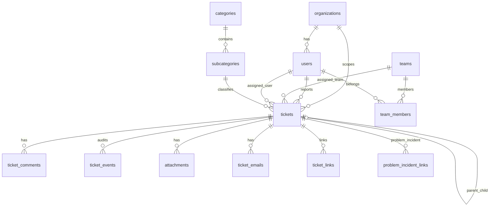

# Legacy ITSM reference → STARdesk data model mapping

How STAR’s current PostgreSQL schema relates to a typical **legacy ITSM** implementation (Sagsstyring, second line, persons/assets). Use this when building `/classic/*` and when scoping API work — **no separate legacy ITSM schema** exists in the repo today.

**Sources checked:** `init.sql`, `apps/api/src/star_itsm_api/models/*`, `schemas/ticket.py`, `apps/web/src/types/*`, migrations under `sql/migrations/`.

---

## Summary

| Coverage | Meaning |
|----------|---------|
| **Strong** | Same concept, first-class table/field, used in API + UI |
| **Partial** | Concept exists but different shape, JSONB, or UI-only |
| **Gap** | Reference ITSM has it; STARdesk needs extension or classic UI stub |
| **N/A** | Reference module not in scope (Ejendom full CMDB, Change calendar) |

STARdesk is an **ITSM ticket-centric** model (incident / service_request / problem), not a full legacy ITSM clone. Classic UI should **surface existing fields** and label gaps honestly.

---

## Reference ITSM modules → STARdesk

| Reference module (photo 10) | STARdesk today | Notes |
|---------------------------|----------------|-------|
| **Sagsstyring** | Core `tickets` + teams + SLA | Primary match |
| **Videnshåndtering** | `tickets` with `is_knowledge_article` + `/knowledge` | Knowledge as ticket flag, not separate KB object |
| **Ejendomshåndatering** | CMDB graph `/aktiver` (client catalog + API graph) | Not legacy “location/card” model; environment on assets |
| **Grunddata** | `categories`, `subcategories`, `sub_causes`, `teams`, `organizations` | Master data spread across tables |

---

## Core call / incident (reference “Second line sag” / “Henvendelse”)

| Reference UI (screendumps) | STARdesk table.column | API / type | Match |
|----------------------|------------------------|------------|-------|
| Sag-nummer | `tickets.ticket_number` | `Ticket.ticket_number` | **Strong** |
| Sag-type (Henvendelse, Incident, Bug, Service Request) | `tickets.ticket_type` | `incident` \| `service_request` \| `problem` | **Partial** — no separate `bug`; map to `incident` |
| Kort beskrivelse | `tickets.title` | `Ticket.title` | **Strong** |
| Beskrivelse / tråd | `tickets.description` + `ticket_comments` | `TicketDetail.description`, `comments` | **Strong** |
| Status (Tildelt, Løst, Lukket, …) | `tickets.status` | `new`, `assigned`, `in_progress`, `on_hold`, `resolved`, `closed`, `cancelled` | **Partial** — map labels in classic UI (see status table below) |
| Prioritet (1–Kritisk …) | `tickets.priority` | `critical`, `high`, `medium`, `low` | **Strong** |
| Ansvarliggruppe | `tickets.assigned_team_id` → `teams.name` | `assigned_team_name` | **Strong** |
| Ansvarlig (operator) | `tickets.assigned_user_id` → `users.display_name` | `assigned_user_name` | **Strong** |
| Underkategori | `tickets.subcategory_id` → `subcategories.name_da` | `subcategory_name_da` | **Strong** |
| Kategori / classification path | `categories` + `subcategories` | `category_name_da` | **Strong** |
| Dato/tid oprettelse | `tickets.created_at` | ISO in API | **Strong** |
| Rekvirant / caller | `tickets.reporter_user_id` | `reporter_display_name` | **Strong** |
| Filial / organisation | `tickets.organization_id`, `users.organization_id` | `organization_name` on user | **Partial** — org on ticket + user; no “branch” hierarchy |
| Miljø (TX, Produktion) | CMDB `AssetDetail.environment` or tags | — | **Gap** on ticket — use `tags` / `routing_metadata` or link asset later |
| Lukkekode | — | — | **Gap** — could use `routing_metadata.closing_code` or new column |
| Forfaldsdato / SLA | `resolution_due_at`, `response_due_at` | SLA fields on list/detail | **Strong** |
| Besvaret / Udført / Lukket timestamps | `first_response_at`, `resolved_at`, `closed_at`, … | `TicketTimestamps` | **Strong** |
| Større sag | `tickets.is_major` | `is_major` | **Strong** |
| Eskaleret | `tickets.escalation_level`, `last_escalation_at` | `escalation_level` | **Partial** |
| Delvise sager | `tickets.parent_ticket_id` | parent/children on detail | **Strong** |
| Tags / øvrige tags | `tickets.tags` | `tags[]` | **Strong** |
| RCA, team prioritering, user story | `routing_metadata` (JSONB) or `tags` | optional in UI | **Partial** — store in `routing_metadata` until formal fields |
| Fejlviseret | `tickets.fault_displayed` | on assignment | **Strong** |
| Tildelingsårsag | `tickets.assignment_reason` | PATCH assignment | **Strong** |

### Status label mapping (classic UI)

| Reference UI (examples) | STARdesk `status` |
|--------------------|-------------------|
| Tildelt | `assigned` |
| I behandling | `in_progress` |
| Løst | `resolved` |
| Lukket | `closed` |
| Ny / modtaget | `new` |
| På hold | `on_hold` |
| Annulleret | `cancelled` |

---

## First line vs second line

| Reference UI | STARdesk | Recommendation |
|---------|----------|----------------|
| First line sag | Often `incident` + team **SF Service Desk** | Filter: `ticket_type=incident` AND `assigned_team` = desk team |
| Second line sag | Same `tickets` row; different team/queue | Filter by `assigned_team_id` / routing rules, not separate table |
| Ny Second Line-sag | `POST /api/v1/tickets` | Create with `ticket_type=incident`, default team via routing |

**No `line` column** — use **team** + **saved filter** (classic list definitions in config).

---

## Change management (reference “Changes”)

| Reference UI | STARdesk | Your decision |
|---------|----------|---------------|
| Change record | — | **No separate entity** for now |
| Change ≈ service request | `ticket_type = service_request` | **Partial** — classic `/classic/changes` uses this |
| Release, miljø, milestone, patch dato, nedetid | — | **Gap** — candidate: `routing_metadata` keys or future `ticket_custom_fields` |

---

## Problem management

| Reference UI | STARdesk | Match |
|---------|----------|-------|
| Problem record | `ticket_type = problem` | **Strong** |
| Link problem ↔ incidents | `problem_incident_links` | **Strong** (API exists) |
| Known error / root cause | `tickets.root_cause`, `workaround` (in older init; check ORM) | Verify API exposure on detail |

---

## User card / operator settings (gear → Mine indstillinger)

| Reference UI | STARdesk | Match |
|---------|----------|-------|
| Operator person record | `users` | **Strong** (identity) |
| Mine indstillinger (preferences) | — | **Gap** — no `user_preferences` table |
| Profile “card” UI | Staff: `/users/{id}` via `AdminUserDetail`; portal: `/profile` | **Partial** |
| Avatar | `avatar_url`, `avatar_preset_id` | **Strong** (`TopBarUserMenu` → Skift billede) |
| Log ud | `/api/auth/logout` | **Strong** |
| Classic vs modern UI | Cookie only (today) | **Partial** → plan `users.ui_mode` on this screen in classic shell |

The reference UI treats the gear screen as the **logged-in operator’s card**, not a separate “person” in Links. In classic, gear should open the same concept for the session user (`GET /api/v1/users/me` or `/users/{self.id}`).

---

## Persons, org, location (photo 5, photo 11)

| Reference UI | STARdesk | Match |
|---------|----------|-------|
| Person (fulde navn, telefon, jobtitel) | `users` | **Partial** — persons are users, not separate “card” |
| Filial | `organizations.name` | **Partial** — flat org, no site tree |
| Lokation (physical) | CMDB assets / selection on ticket | **Gap** — no `ticket.asset_id`; CMDB separate |
| Links → Personer on call | `ticket_links` + reporter | **Partial** — `ticket_links` is ticket↔ticket; person links **gap** |
| Afdeling | `teams` / `team_members.role` | **Partial** |

**Photo 11 (org + asset):** Best current mapping:

```
Person  → users (+ organization_id)
Filial  → organizations
Lokation / CI → AssetSystem / AssetSubsystem (apps/web CMDB, /aktiver)
Ticket  → tickets (+ optional future ticket↔asset link)
```

---

## Communication & attachments (photo 8)

| Reference UI | STARdesk | Match |
|---------|----------|-------|
| E-mails on card | `ticket_emails` | **Strong** (Gmail integration) |
| Logposter | `ticket_comments` + `ticket_events` | **Strong** |
| Vedhæftninger | `attachments` | **Strong** |
| Usynlig for rekvirent | `ticket_comments.is_internal` | **Strong** |

---

## Audit trail (photo 9)

| Reference UI column | STARdesk | Match |
|----------------|----------|-------|
| Dato/Tid | `ticket_events.created_at`, `activity[].occurred_at` | **Strong** |
| Feltnavn | `event_type` + `payload` / `activity.label_da` | **Partial** |
| Fra-værdi / Til-værdi | `payload` JSON on events | **Partial** — build formatter in classic tab |
| Af | `actor_user_id` → display name | **Strong** |
| Årsag | — | **Gap** unless stored in payload |

Event types include: `ticket.status_changed`, `ticket.metadata_changed`, `ticket.priority_changed`, `ticket.type_changed`, `ticket.parent_changed`, assignment events.

---

## SLA & planning (photo 3–4)

| Reference UI | STARdesk | Match |
|---------|----------|-------|
| SLA / forfald | `sla_policies`, `sla_assignments`, due timestamps | **Strong** |
| Varighed / totaler | Computed in services or `TicketTimestamps` | **Partial** |
| Servicevindue | — | **Gap** |
| Pause-varighed | `sla_pause_total_seconds`, `sla_paused_at` | **Partial** |

---

## Teams & operator groups (reference “Ansvarliggruppe”)

| Reference UI | STARdesk | Match |
|---------|----------|-------|
| Operator group | `teams` | **Strong** |
| Group members | `team_members` | **Strong** |
| Operator group in external sync config | — | **Gap** — no external ITSM sync configured |

Seed teams in `init.sql` align with STAR naming: SF Service Desk, SF Infrastruktur, SF Operations, Applikation.

---

## Knowledge (reference Videnshåndtering)

| Reference UI | STARdesk | Match |
|---------|----------|-------|
| Knowledge item | `tickets` where `is_knowledge_article=true` | **Partial** |
| Visibility / status | `knowledge_status`, `knowledge_visibility` | **Strong** within ticket model |

---

## CMDB / assets (Ejendomshåndtering lite)

| Reference asset/CI | STARdesk | Match |
|------------------|----------|-------|
| Configuration item | `AssetSystem`, `AssetSubsystem` | **Partial** — graph in API, not ticket-linked |
| Environment (Produktion/Test) | `AssetDetail.environment` | **Strong** in CMDB |
| Owner team | `ownerTeam` on asset | **Partial** |
| Audit on catalog | `cmdb_audit_log` | **Strong** for catalog edits |

---

## Integrations (external systems)

| Item | Location | Status |
|------|----------|--------|
| Jira, Gmail, Slack | `organization_integrations`, routers | Active/mock |
| External ITSM sync | — | **Gap** — no bi-directional sync tables; use `routing_metadata.external_number` on import |

If bi-directional sync is needed later: add `external_refs JSONB` on `tickets` e.g. `{ "legacy_itsm": { "id": "...", "number": "..." } }`.

---

## JSONB extension point (legacy custom fields without migrations)

` tickets.routing_metadata` already exists. Suggested keys for classic parity **until** dedicated columns:

```json
{
  "classic_custom": {
    "environment": "Produktion",
    "environment_note": "",
    "closing_code": "Workaround",
    "release": "STARCloud",
    "milestone": "",
    "rca": "",
    "team_priority": "",
    "user_story": ""
  }
}
```

Requires API PATCH to accept/merge `routing_metadata` on metadata update (verify `TicketMetadataUpdate` schema).

---

## Classic UI: what to bind per tab (photos 3–9)

| Classic tab | Primary STARdesk data |
|-------------|------------------------|
| Generelt | `TicketDetail`, `comments`, assignment PATCH |
| Information | `timestamps`, `escalation_level`, `is_major`, SLA fields |
| Links → Personer | `reporter` + **stub** for linked persons until person-link API |
| Release og planlægning | `routing_metadata`, `tags`, `sub_causes` |
| Dev/tags | `tags`, `routing_metadata`, routing AI fields |
| Vedhæftninger → E-mails | `ticket_emails`, `attachments` |
| Auditspor | `activity` / `ticket_events` |

---

## Recommended API gaps for classic (priority)

1. **`GET /api/v1/tickets?ticket_type=incident`** — avoid loading 500 rows client-side.
2. **Expose `organization_name` on ticket list** — for “Filial” column.
3. **PATCH `routing_metadata`** on ticket (if not already) — Release/miljø/lukkekode.
4. **`users.ui_mode`** — per your roadmap (login flow).
5. **Optional `ticket.asset_id` or link table** — for photo 11 lokation (later).

---

## Entity relationship (simplified)



---

## Files to read when implementing

| Area | Path |
|------|------|
| Ticket ORM | `apps/api/src/star_itsm_api/models/ticket.py` |
| Ticket API schema | `apps/api/src/star_itsm_api/schemas/ticket.py` |
| List/filter logic | `apps/api/src/star_itsm_api/routers/tickets.py` |
| Activity/audit | `apps/api/src/star_itsm_api/services/ticket_activity.py` |
| Web types | `apps/web/src/types/ticket.ts`, `ticket-activity.ts` |
| Org | `apps/api/src/star_itsm_api/models/organization.py` |
| CMDB | `apps/web/src/types/asset.ts`, `routers/assets.py` |
| Classic modules | `apps/web/src/lib/classic-modules.ts` |
| UI parity | `docs/classic-ui-parity-map.md` |

---

## Conclusion

STARdesk **already implements a coherent ITSM core** aligned with reference **Sagsstyring** (calls/incidents/problems, operators, groups, SLA, audit, email, partial org). Gaps are mostly **legacy-specific fields** (lukkekode, miljø on card, release/milestone, person cards, work-area tabs) and **Change as a separate process** — which you deferred.

Classic UI should use **strong mappings first**, then `routing_metadata` + stubs for the rest, without pretending fields exist when they do not.
