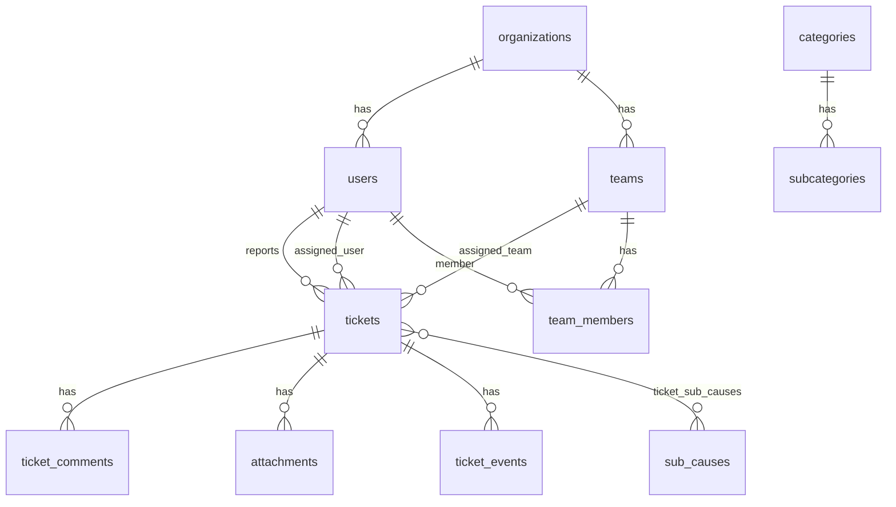

# Datastruktur (domænemodel)

Sandheden i kode: SQLAlchemy-modeller i `apps/api/src/star_itsm_api/models/`.
Basis-schema: `init.sql`. Cloud-udvidelser: `docs/*-migration.sql`.

## Entitetsdiagram (oversigt)

## Enum-værdier

### `users.role`

| Værdi | UI (dansk) | Betydning |
|-------|------------|-----------|
| `end_user` | Indmelder | Self-service, egne sager |
| `agent` | Agent | Sagsbehandling |
| `admin` | Administrator | Fuld adgang (SF) |

### `tickets.ticket_type`

`service_request` | `incident` | `problem`

### `tickets.status`

`new` → `assigned` → `in_progress` → `on_hold` → `resolved` → `closed` | `cancelled`

### `tickets.priority`

`critical` | `high` | `medium` | `low`

### `tickets.source`

`portal` | `email` | `api` | `phone`

### `tickets.intelligence_source`

`seed` | `heuristic` | `llm` | `manual`

### `attachments.scan_status`

`pending` | `scanning` | `clean` | `infected` | `failed`

## Kerne-tabeller

### `users`

| Kolonne | Type | Note |
|---------|------|------|
| id | UUID | PK |
| email | VARCHAR | UNIQUE, lowercase ved login |
| display_name | VARCHAR | |
| role | VARCHAR | se enum |
| is_active | BOOLEAN | |
| password_hash | VARCHAR | bcrypt (migration) |
| organization_id | UUID | FK → organizations (virksomheds-agent) |
| external_id | VARCHAR | reserveret |
| created_at, updated_at, deleted_at | TIMESTAMPTZ | soft delete |

### `organizations`

| Kolonne | Type |
|---------|------|
| id | UUID |
| name | VARCHAR UNIQUE |
| description | TEXT |
| is_active | BOOLEAN |

### `teams`

| Kolonne | Type | Note |
|---------|------|------|
| id | UUID | |
| name | VARCHAR UNIQUE | fx `SF`, `Jobflow` |
| organization_id | UUID | NULL for SF hovedgruppe |
| escalation_email | VARCHAR | SLA-mail |
| is_active | BOOLEAN | |

### `team_members`

Komposit PK: `(team_id, user_id)`.

### `tickets`

| Kolonne | Type | Note |
|---------|------|------|
| id | UUID | |
| ticket_number | VARCHAR UNIQUE | fx `INC-0001`, `DEMO-0001` |
| title, description | VARCHAR / TEXT | |
| status, priority, ticket_type | VARCHAR | |
| reporter_user_id | UUID | FK users |
| organization_id | UUID | arver ofte fra indmelder/org |
| assigned_team_id, assigned_user_id | UUID | nullable |
| category_id, subcategory_id | UUID | |
| source | VARCHAR | |
| sla_policy_id | UUID | |
| response_due_at, resolution_due_at | TIMESTAMPTZ | |
| first_response_at, assigned_at, in_progress_at, on_hold_at, resolved_at, closed_at, cancelled_at | TIMESTAMPTZ | milepæle |
| gdpr_consent, gdpr_consent_at | BOOL / TIMESTAMPTZ | |
| subject_cpr | VARCHAR(11) | kun hvor tilladt |
| assignment_reason | TEXT | ved tildeling |
| fault_displayed | BOOLEAN | fejlviseret |
| tags | TEXT[] | max 10, normaliseret lowercase |
| emoji | VARCHAR(16) | kurateret liste |
| semantic_topics | TEXT[] | LLM/triage |
| ease_score | SMALLINT 1–5 | lethed (5 = let) |
| complexity_score | SMALLINT 1–5 | kompleksitet |
| llm_summary | TEXT | |
| handling_hints | TEXT[] | |
| intelligence_source, intelligence_updated_at | | |
| is_major | BOOLEAN | stor sag |
| escalation_level | SMALLINT 0–3 | |
| description_embedding | VECTOR(1024) | init.sql, fremtidig RAG |
| created_at, updated_at, deleted_at | TIMESTAMPTZ | |

### `ticket_comments`

| Kolonne | Note |
|---------|------|
| is_internal | agent-only vs. kunde-synlig |
| author_user_id | |

### `attachments`

| Kolonne | Note |
|---------|------|
| storage_key | filsti på disk / upload_dir |
| visible_to_submitter | efter godkendt scan |
| scan_status | se enum |

### `ticket_events`

Audit-log: `event_type` + JSON `payload` (fx `ticket.assigned`, `comment.created`).

### `sub_causes` + `ticket_sub_causes`

Underårsager (mange-til-mange på ticket).

### `categories` / `subcategories`

Dansk visning: `name_da`. Routing og SLA kan pege på kategori.

### `sla_policies` / `sla_assignments` / `routing_rules`

Se `init.sql` — bruges ved oprettelse af sag.

## Indekser (vigtige)

- `tickets`: status, assigned_team, reporter, GIN på tags og semantic_topics
- `users.email` WHERE deleted_at IS NULL
- Trigram på title/description (søgning)

## TypeScript-spejl (frontend)

`apps/web/src/types/ticket.ts`, `user.ts`, `team.ts` — hold synkron med API Pydantic schemas i `apps/api/src/star_itsm_api/schemas/`.
