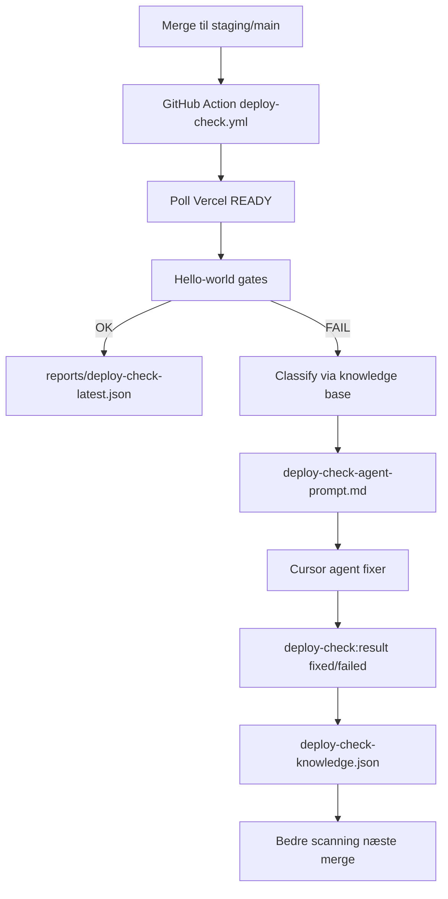

# Deploy Check Agent

Automatisk agent der tjekker Vercel-deploys for fejl **efter hver merge** til `staging` eller `main`. Den lærer af hver fejlretning og forbedrer scanningen over tid.

## Problem

CI kan være grøn mens Vercel-deploy fejler (manglende env, Preview Protection, build-fejl). Watchdog overvågede ikke deploy-status — kun Sonar-loop og PR-flow.

## Løsning



## Kørsel

### Automatisk (hook)

- **Push til `staging`** → staging Preview check (API + UI)
- **Push til `main`** → production API check (eskalerer ved fejl — Jan)

Workflow: `.github/workflows/deploy-check.yml`

Kræver GitHub secrets:

| Secret | Formål |
|--------|--------|
| `VERCEL_TOKEN` | Poll deployment status |
| `VERCEL_PROTECTION_BYPASS` | Preview protection (valgfri men anbefalet) |
| `TEST_USER_PASSWORD` | Demo-login (`Stardesk2026!`) |

### Manuel / VM

```bash
cd scripts
npm run deploy-check:pipeline              # staging
npm run deploy-check:pipeline -- staging --full
npm run deploy-check:pipeline -- production
```

### Feedback efter fix

```bash
cd scripts
# Lykkedes:
npm run deploy-check:result -- --pattern database-not-configured --status fixed \
  --notes "DATABASE_URL sat på api Preview" --pr "https://github.com/.../pull/123"

# Fejlede stadig:
npm run deploy-check:result -- --pattern database-not-configured --status failed \
  --notes "Redeploy hjalp ikke — tjek Neon test branch"

# Ny fejl-signatur (forbedrer næste scan):
npm run deploy-check:result -- --pattern login-failed --status failed \
  --add-match "jwt expired" --notes "Token TTL for kort"
```

## Rapporter

| Fil | Indhold |
|-----|---------|
| `reports/deploy-check-latest.json` | Seneste scan (maskine) |
| `reports/deploy-check-latest.md` | Menneske-læsbar |
| `reports/deploy-check-agent-prompt.md` | Agent-handoff ved fejl |
| `reports/deploy-check-knowledge.json` | Akkumuleret viden + fix-historik |
| `scripts/deploy-check/knowledge-seed.json` | Basis-mønstre (committet) |

`checkSuiteVersion` stiger når nye match-strenge eller mønstre tilføjes.

## Kendte fejlmønstre (seed)

Se `scripts/deploy-check/knowledge-seed.json` — bl.a.:

- Vercel Deployment Protection (401)
- `Database is not configured` (manglende Preview `DATABASE_URL`)
- Login/tickets/seed
- Vercel build ERROR
- Forkert `STARDESK_ENV` på Preview

## Agent-skill

`.cursor/skills/stardesk-deploy-check/SKILL.md`

## Watchdog

`stardesk-watchdog` tjekker om staging deploy-check er forældet (>2 timer siden sidste grønne scan) og kan trigge `npm run deploy-check:pipeline`.

## Relateret

- [staging-vercel-preview-env.md](./staging-vercel-preview-env.md)
- [deliverable-gate.md](./deliverable-gate.md)
- [stardesk-watchdog.md](./stardesk-watchdog.md)
