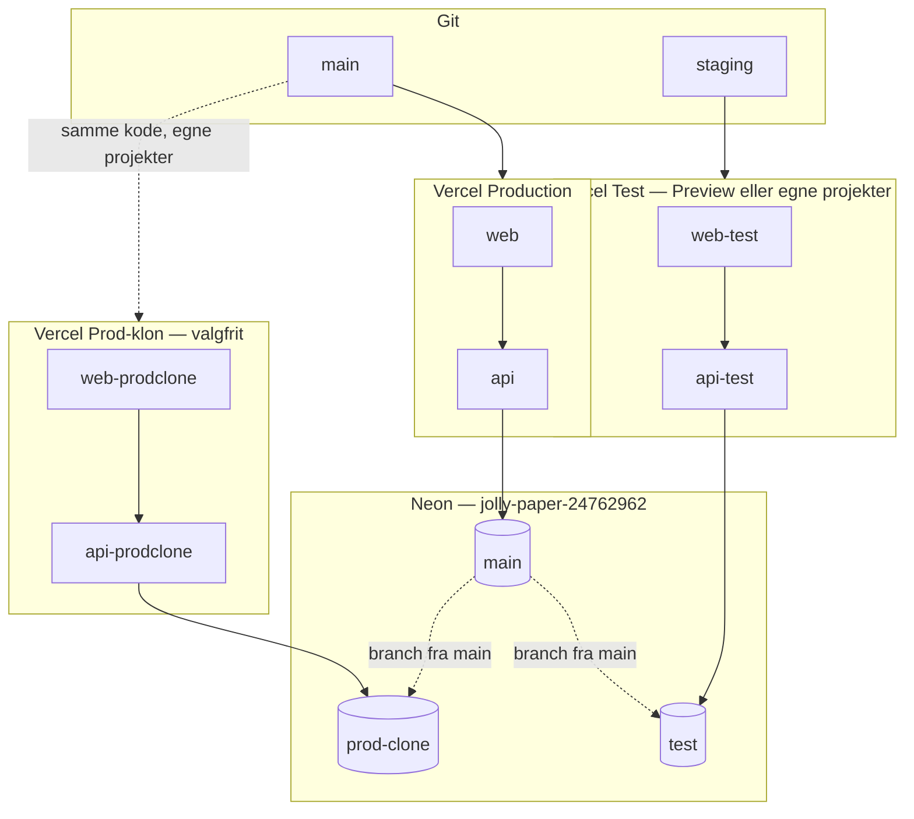

# STARdesk — test vs. produktion vs. prod-klon

Denne guide beskriver en **tre-lags opdeling** af cloud-miljøet: rigtig produktion, dedikeret **test**, og en **prod-klon** (samme konfiguration som prod, men isoleret database og egne URLs).

> **Sikkerhed:** Commit aldrig `.env`, `.env.local` eller `vercel env pull`-filer. Kun **navne** på variabler dokumenteres her.

## Oversigt



| Miljø | Formål | Git | Vercel | Neon-gren | Typiske URLs |
|-------|--------|-----|--------|-------------|--------------|
| **Produktion** | Live brugere | `main` | Eksisterende `web` + `api`, scope **Production** | `main` (default) | `https://web-seven-neon-6bvmcoel7n.vercel.app`, `https://api-gamma-amber.vercel.app` |
| **Test** | QA, demo-brugere, migrationer, load/destructive (med flag) | `staging` (anbefalet) eller PR | **Preview** på samme projekter *eller* `web-test` / `api-test` | `test` (schema + seed/test-data) | `https://web-test-….vercel.app`, `https://api-test-….vercel.app` |
| **Prod-klon** | UAT: prod-lignende secrets og flows, **uden** at røre prod-DB | `main` (manuelt deploy) | `web-prodclone` / `api-prodclone` (duplikerede projekter) | `prod-clone` (kopieret fra `main` på oprettelsestidspunkt) | Egne `*.vercel.app` efter oprettelse |

### Anbefalet strategi for STARdesk

> **Kort dansk guide (kun dev, ikke prod ved et uheld):** [dev-only-workflow.md](./dev-only-workflow.md)

1. **Behold** nuværende `web` + `api` som **produktion** (`main` → Production).
2. Opret Neon-gren **`test`** og kør `scripts/run_neon_setup.py` + `docs/test-data.sql` der.
3. Udfyld **Preview**-miljøvariabler på begge Vercel-projekter (i dag er Preview **tom** — se [Nuværende Vercel-tilstand](#nuværende-vercel-tilstand)).
4. Peg `staging`-branch deploys på test-DB og test-URLs (Preview scope).
5. Opret **prod-klon** kun hvis I skal validere med **samme** JWT/integrations-nøgler som prod mod en **kopi** af data — ellers er test-miljøet nok.

Alternativ: separate Vercel-projekter (`web-test`, `api-test`) giver tydeligere URLs og undgår at forveksle Production med Preview.

---

## Nuværende Vercel-tilstand

Team: **kjaerby-1628s-projects** (`team_WAOS6DVTpQTnSqopWOIZf717`)

| Projekt | Project ID | Production-domæne |
|---------|------------|-------------------|
| `web` | `prj_yp7rtTY7itzDFBuJqfMrL0urNybx` | `web-seven-neon-6bvmcoel7n.vercel.app` |
| `api` | `prj_TG8sOhHjUBMrcSmTVEDpr1rydHP0` | `api-gamma-amber.vercel.app` |

**Production — variabelnavne (kun navne, maj 2026):**

| `api` | `web` |
|-------|-------|
| `DATABASE_URL` | `NEXT_PUBLIC_API_URL` |
| `FRONTEND_URL` | `FRONTEND_URL` *(bør typisk kun stå på API — overvej at fjerne fra web)* |
| `JWT_SECRET` | |

**Preview:** ingen variabler registreret på hverken `api` eller `web`. Preview-deploys fra feature branches får derfor **ikke** database eller API-URL, medmindre I tilføjer Preview-scoped vars.

**Foreslåede nye projektnavne** (ved duplikering i dashboard: *Add New → Project*, samme repo, samme root directory):

| Rolle | Web-projekt | API-projekt | Root directory |
|-------|-------------|-------------|----------------|
| Test | `web-test` | `api-test` | `apps/web` / `apps/api` |
| Prod-klon | `web-prodclone` | `api-prodclone` | `apps/web` / `apps/api` |

---

## Neon

**Projekt (reference):** `jolly-paper-24762962` (Neon console-navn; ID bruges i API/CLI).

### Gren-strategi

| Gren | Parent | Data-politik |
|------|--------|--------------|
| `main` | — | Produktionsdata — **ingen** destructive scripts uden godkendelse |
| `test` | `main` | Tom kopi eller kun schema; kør migrations + `docs/test-data.sql` / seeds |
| `prod-clone` | `main` | Point-in-time kopi ved oprettelse; til UAT; roter/reset efter behov |

### Opret gren (CLI)

Installer [Neon CLI](https://neon.tech/docs/reference/cli-install) og log ind (`neon auth`).

```powershell
# Liste grene
neon branches list --project-id jolly-paper-24762962

# Test-gren (schema kopieres; data følger parent på oprettelsestidspunkt)
neon branches create --project-id jolly-paper-24762962 --name test --parent main

# Prod-klon (samme, men bruges kun til UAT)
neon branches create --project-id jolly-paper-24762962 --name prod-clone --parent main
```

Hent connection string i Neon → **Branches** → vælg gren → **Connection string** → skift til `postgresql+asyncpg://…` til `DATABASE_URL`.

### MCP (Cursor)

- `list_projects` — find Neon-projekt-ID
- `create_branch` — `projectId` + `branchName` (`test`, `prod-clone`)

Efter ny gren: kør setup mod **test** (ikke prod):

```powershell
cd apps\api
$env:DATABASE_URL = "postgresql+asyncpg://..."   # test-gren, lokalt — commit ikke
python ..\..\scripts\run_neon_setup.py
```

---

## Miljøvariabler — hvem skal have hvad

Fuld liste fra kode: `apps/api/src/star_itsm_api/core/config.py`, `apps/web` middleware og `NEXT_PUBLIC_*`.

Manifest (kun navne): [`deploy/vercel/env-manifest.json`](../deploy/vercel/env-manifest.json)

### `apps/api`

| Variabel | Produktion | Test | Prod-klon |
|----------|------------|------|-----------|
| `DATABASE_URL` | Neon `main` | Neon `test` | Neon `prod-clone` |
| `FRONTEND_URL` | Prod web-URL (+ evt. localhost) | Test web-URL | Prod-klon web-URL |
| `JWT_SECRET` | Stærk, unik | **Egen** test-hemmelighed | **Samme som prod** (hvis formålet er UAT) |
| `APP_ENV` | `production` | `development` eller `test` | `production` |
| `CRON_SECRET` | Påkrævet ved `APP_ENV=production` | Test-værdi eller tom hvis ikke production | Som prod |
| `WEBHOOK_SECRET` | Som ovenfor | Test-værdi | Som prod |
| `RESEND_API_KEY` | Prod/domæne | Resend test/sandbox eller tom | Som prod |
| `MAIL_FROM` | Prod afsender | Test afsender | Som prod |
| Slack/Gmail `*_CLIENT_*`, `*_REDIRECT_URI` | Prod OAuth apps | **Separate** test OAuth apps med test callback-URLs | Prod OAuth (opdater redirect tilladelser til klon-URLs) |
| `SLACK_MOCK` / `GMAIL_MOCK` | `0` | `1` muligt lokalt | `0` |

### `apps/web`

| Variabel | Produktion | Test | Prod-klon |
|----------|------------|------|-----------|
| `NEXT_PUBLIC_API_URL` | `https://api-gamma-amber.vercel.app` | Test API-URL | Prod-klon API-URL |
| `NEXT_PUBLIC_ENABLE_DEMO_LOGIN` | `false` eller udeladt | `true` | `false` |
| `BASIC_AUTH_USER` / `BASIC_AUTH_PASSWORD` | Udeladt | **Anbefalet** på test | Valgfrit |
| `FRONTEND_URL` | — | Fjern fra web hvis kun API skal have CORS | — |

---

## Git- og deploy-flow

```text
main     ──push──► Vercel Production (web + api)     ──► Neon main
staging  ──push──► Vercel Preview (samme projekter)  ──► Neon test
feature/* ──PR──► Preview (arver Preview-env)        ──► Neon test (anbefalet)
```

1. Opret `staging` i GitHub fra `main`.
2. I Vercel → begge projekter → **Settings → Git** → Production Branch = `main`.
3. Tilføj alle test-variabler under **Environment Variables → Preview** (og evt. **Preview** kun for branch `staging` via *Edit* → *Specific Branches*).
4. Redeploy `staging` efter env er sat.

Prod-klon deployes typisk **manuelt** fra `main` til dedikerede projekter, når I vil køre UAT — ikke på hver push.

---

## Trin-for-trin: opret test-miljø

Kør hjælpescriptet (tjekliste + kommandoer):

```powershell
.\scripts\setup-test-environment.ps1
```

### Manuelle trin (Vercel)

1. **Neon:** opret gren `test`, kopiér `DATABASE_URL` (`+asyncpg`).
2. **API-projekt** (`api` eller nyt `api-test`):
   - Root Directory: `apps/api`
   - Preview (eller dedikeret projekt): sæt variabler fra [`apps/api/.env.test.example`](../apps/api/.env.test.example)
   - `FRONTEND_URL` = fremtidig test-web-URL (sættes endeligt efter web deploy)
3. **Web-projekt** (`web` eller `web-test`):
   - Root Directory: `apps/web`
   - `NEXT_PUBLIC_API_URL` = test API-URL
   - `NEXT_PUBLIC_ENABLE_DEMO_LOGIN=true`
   - Valgfrit: `BASIC_AUTH_USER` + `BASIC_AUTH_PASSWORD`
4. Deploy web → opdater API `FRONTEND_URL` → redeploy API.
5. Kør DB-setup mod test-gren (se [database-rebuild.md](./database-rebuild.md)).
6. Verificer: `GET <test-api>/health`, login på test-web.

### Kopier prod-env til prod-klon (uden at lække secrets i git)

```powershell
# Fra apps/api — kræver Vercel CLI login
cd apps\api
vercel link   # vælg team + api-prodclone
vercel env pull .env.production.reference --environment=production
# Rediger lokalt: DATABASE_URL, FRONTEND_URL — commit ALDRIG filen
vercel env add DATABASE_URL preview    # gentag for prod-klon-projektets Production scope
```

I dashboard: **Project → Settings → Environment Variables → … → Duplicate** fra `api` til `api-prodclone`, derefter overskriv kun:

- `DATABASE_URL` → prod-clone gren
- `FRONTEND_URL` → web-prodclone URL

Gentag for `web` med kun `NEXT_PUBLIC_API_URL` (og evt. fjern `FRONTEND_URL` på web).

---

## URL- og DB-mapping (skabelon)

Udfyld efter I har oprettet test/klon-projekter:

| Miljø | Web | API | Neon-gren |
|-------|-----|-----|-----------|
| Produktion | `https://web-seven-neon-6bvmcoel7n.vercel.app` | `https://api-gamma-amber.vercel.app` | `main` |
| Test / **staging** (Preview) | `https://web-git-staging-kjaerby-1628s-projects.vercel.app` | `https://api-git-staging-kjaerby-1628s-projects.vercel.app` | `test` |
| Prod-klon | `https://____________.vercel.app` | `https://____________.vercel.app` | `prod-clone` |

---

## Drift og sikkerhed

- **Destructive/load tests:** kun mod test-URLs; se [destructive-testing.md](./destructive-testing.md).
- **Prod-klon** indeholder ofte en kopi af rigtige data — beskyt med `BASIC_AUTH`, begrænset adgang, og slet/reset gren periodisk.
- **OAuth:** hver miljø-URL skal være whitelistet i Slack/Google redirect URIs.
- **Cron** på Vercel (`apps/api/vercel.json`): overvej at deaktivere cron på test/klon eller bruge separat `CRON_SECRET`.
- Efter env-ændring: **Redeploy** (build-time for `NEXT_PUBLIC_*`).

---

## Relaterede filer

| Fil | Indhold |
|-----|---------|
| [deploy.md](./deploy.md) | Første deploy |
| [deploy/vercel/env-manifest.json](../deploy/vercel/env-manifest.json) | Variabelnavne per target |
| [apps/api/.env.test.example](../apps/api/.env.test.example) | API test-skabelon |
| [apps/api/.env.production.example](../apps/api/.env.production.example) | API prod-skabelon |
| [apps/web/.env.test.example](../apps/web/.env.test.example) | Web test-skabelon |
| [apps/web/.env.production.example](../apps/web/.env.production.example) | Web prod-skabelon |
| [scripts/setup-test-environment.ps1](../scripts/setup-test-environment.ps1) | Interaktiv tjekliste |
