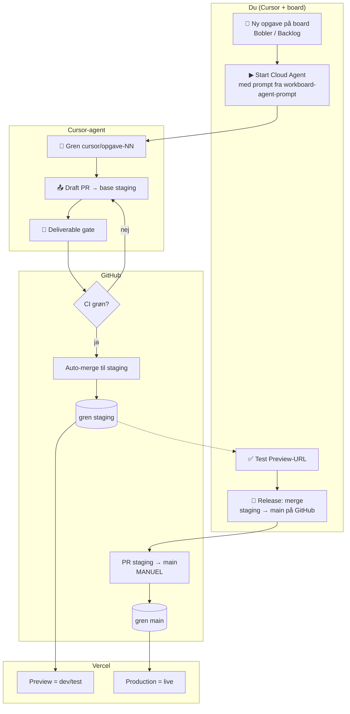

# STARdesk — proces (visuelt overblik for Jan)

> Fuld tekst: [release-process.md](./release-process.md) · Agent-tekst: [workboard-agent-prompt.md](./workboard-agent-prompt.md)  
> **PR-only periode:** [pr-only-period.md](./pr-only-period.md)

---

## Hele flowet på én side



---

## Tre zoner (husk det sådan)

| Zone | Hvor du kigger | Hvad sker der |
|------|----------------|---------------|
| **1. Plan** | Cursor Work Board | Opgave, agent, PR oprettes |
| **2. Dev** | GitHub PR → **staging** | Auto-merge, Vercel **Preview** |
| **3. Prod** | GitHub PR **staging → main** | **Du** merger, Vercel **Production** |

**Aldrig:** agent der merger direkte til `main` uden din release-PR.

---

## Din hverdag (trin for trin)

| Trin | Hvad du gør | Hvor |
|:----:|-------------|------|
| **1** | Opret opgave med nr. + titel | Simpelt board / Work Board |
| **2** | Kopiér prompt → start agent | [workboard-agent-prompt.md](./workboard-agent-prompt.md) |
| **3** | Vent; få PR-link i chat | Cursor |
| **4** | (Valgfrit) Se PR og grønne checks | [github.com/.../pulls](https://github.com/LarrySAIndersen/STARDESK/pulls) |
| **5** | Test appen | Vercel **Preview**-link fra PR |
| **6** | Når alt OK over tid | [Compare staging → main](https://github.com/LarrySAIndersen/STARDESK/compare/main...staging?expand=1) |
| **7** | Merge release-PR | GitHub — **kun her kommer prod** |

---

## Tekst på hvert board-kort (copy-paste)

Sæt i beskrivelse eller som fast note på nye kort:

```text
Git: PR mod staging (auto) → prod kun via staging→main af Jan.
Agent-prompt: STARDESK/docs/workboard-agent-prompt.md
```

Kort version til titel-felt / label:

```text
PR → staging | prod: manuel release
```

---

## Links du skal bruge

| Formål | Link |
|--------|------|
| Alle PR’er | https://github.com/LarrySAIndersen/STARDESK/pulls |
| Release til prod (opret PR) | https://github.com/LarrySAIndersen/STARDESK/compare/main...staging?expand=1 |
| Actions (CI / auto-merge) | https://github.com/LarrySAIndersen/STARDESK/actions |
| Proces (denne side i repo) | https://github.com/LarrySAIndersen/STARDESK/blob/main/docs/proces-visuelt.md |

---

## Hvad er automatisk vs. manuelt

| Automatisk | Manuelt (dig) |
|------------|----------------|
| Agent opretter gren + PR mod `staging` | Oprette opgave + starte agent |
| CI (tests, gate) | Merge **staging → main** (prod) |
| Merge PR **ind i `staging`** når CI grøn | Beslutte *hvornår* release er klar |
| Vercel Preview efter merge til `staging` | Godkende prod efter test |

---

## Én gangs opsætning (hvis ikke gjort)

Se [dev-only-workflow.md](./dev-only-workflow.md): branch protection `main`, Preview-env i Vercel, Neon **test** i secrets.
