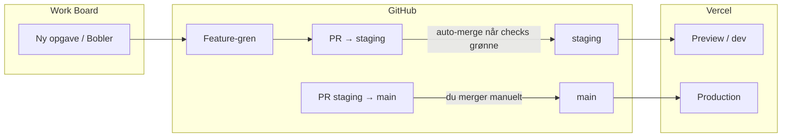

# Release-proces: Board → staging (auto) → prod (manuel)

**Visuelt overblik (Jan):** [proces-visuelt.md](./proces-visuelt.md)

To-trins model for **STARdesk** når du bruger **Cursor**, **GitHub PR’er** og **Vercel**:

1. **Alt ny kode** lander på **`staging`** via PR (Preview/dev) — ikke direkte på prod.
2. **Prod** (`main`) opdateres kun via en **separat, manuel** PR `staging` → `main`.

Vercel deployer **ikke** fordi du gemmer i Cursor — den deployer når GitHub-grenen opdateres (efter merge).

---

## Overblik

---

## Trin 0 — én gangs opsætning

| # | Hvor | Hvad |
|---|------|------|
| 1 | GitHub | Opret gren **`staging`** fra `main` (se nedenfor) |
| 2 | GitHub | Branch protection på **`main`** — kun PR, du merger |
| 3 | GitHub | Branch protection på **`staging`** — kræv checks (Deliverable gate, Security) |
| 4 | Vercel | Preview-env med Neon **test** (web + api) |
| 5 | GitHub Secrets | `DATABASE_URL` = Neon **test** (til CI gate) |

Detaljer: [dev-only-workflow.md](./dev-only-workflow.md)

**Opret `staging` (hvis den mangler):**  
GitHub → **STARDESK** → branch → `main` → skriv `staging` → **Create branch**.

---

## Trin 1 — Ny opgave på board (simpelt board / Work Board)

Når du opretter en opgave (fx i **Bobler** eller **Backlog**):

1. Giv opgaven et **nummer** og en **kort titel** (som I allerede gør).
2. Start **Cursor Cloud Agent** (eller agent på opgaven) med teksten fra  
   [workboard-agent-prompt.md](./workboard-agent-prompt.md) — udfyld `#NUMMER` og titel.
3. Agenten arbejder på gren `cursor/opgave-NN-kort-navn`.
4. Agenten åbner en **draft PR mod `staging`** — ikke mod `main`.

Du gør **ikke** noget i Vercel her.

---

## Trin 2 — PR til staging (dev) — automatisk merge

| Hvad | Hvem |
|------|------|
| PR **base = `staging`** | Agent |
| CI: **Security** + **Deliverable gate** (hvis `DATABASE_URL` secret) | GitHub Actions |
| **Merge til `staging`** når checks er grønne | Workflow **Auto-merge to staging** |

Efter merge:

- Vercel laver **Preview**-deploy (hvis Preview-env er sat).
- Test på Preview-URL fra PR eller fra seneste `staging`-deploy.

Du behøver **ikke** klikke merge på dev-PR’en, hvis auto-merge kører (se workflow).  
Du **kan** stadig læse PR’en på: https://github.com/LarrySAIndersen/STARDESK/pulls (filtrér base `staging`).

---

## Trin 3 — Prod — kun manuelt

Når **du** vil have det i produktion:

1. GitHub → **New pull request**
2. **base:** `main` ← **compare:** `staging`
3. Titel fx: `Release: staging → main (uge 22)`
4. Læs diff, tjek at Preview/staging er testet
5. **Merge** (squash eller merge commit — vælg én fast praksis)
6. Vercel **Production** deployer web + api
7. CI kan køre **database-migrate** på prod (ved push til `main`)

**Ingen** auto-merge til `main`.

Valgfrit: GitHub → **Actions** → **Promote staging to main (manual)** — kun bekræftelse/checkliste (workflow_dispatch).

---

## Hvad du ser hvor

| Spørgsmål | Svar |
|-----------|------|
| Hvor er PR’er? | https://github.com/LarrySAIndersen/STARDESK/pulls |
| Dev-PR’er | Base = **staging** |
| Release-PR | Base = **main**, compare = **staging** |
| Kører noget stadig i agent-VM? | Kun hvis Cloud Agent har startet dev-servere — ikke det samme som Vercel prod |
| Board | Cursor canvas / Work Board — opgaver styres der; **git sker på GitHub** |

---

## Agent-regler (kort)

- Gren fra **`staging`**, PR mod **`staging`**, aldrig direkte til **`main`**.
- Draft PR indtil CI er grøn; merge til staging kan være automatisk.
- Deliverable gate: `bash scripts/run-deliverable-gate.sh` før “færdig”.
- Prod: nævn i handoff at Jan skal oprette/merge **release-PR** `staging` → `main`.

---

## Relateret

- [dev-only-workflow.md](./dev-only-workflow.md) — Vercel Preview, beskyttelse af main
- [deliverable-gate.md](./deliverable-gate.md) — hello-world check
- [workboard-agent-prompt.md](./workboard-agent-prompt.md) — copy-paste til nye opgaver
