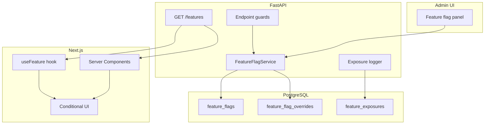

# Feature flags og A/B-test — backlog

Opdateret: 2026-06-20. Oprettet fra chat-afklaring — plan klar til senere implementering.

**Status:** Backlog (ikke startet)  
**Prioritet:** Medium  
**Kontekst:** STARDESK har i dag ingen feature-flag- eller eksperiment-infrastruktur. Kun miljø-skille (`STARDESK_ENV`, `NEXT_PUBLIC_ENABLE_DEMO_LOGIN`) og bruger-attributter (`organization_id`, `role`, teams) kan bruges til targeting.

**Relateret:** `docs/design-decisions.md` (auth/session), `docs/data-model.md` (users, organizations), `apps/api/src/star_itsm_api/services/sla_settings_store.py` (admin-indstillinger-mønster)

---

## Mål

Mulighed for at rulle nye funktioner ud til **nogle brugere og ikke andre**:

- Gradvis rollout (fx 10 % → 50 % → 100 %)
- Pilot på specifikke organisationer eller brugere
- Ægte A/B-test med stabil variant pr. bruger og måling af effekt (fase 2)

---

## Anbefalet tilgang (3 faser)

### Fase 1 — Feature flags med server-side targeting (MVP)

| Komponent | Beskrivelse |
|-----------|-------------|
| Datamodel | `feature_flags` + evt. `feature_flag_overrides` (allowlist/blocklist pr. user/org) |
| Evaluering | Kun på **API** — aldrig client-supplied |
| Bucketing | Deterministisk: `hash(user_id + flag_key) → 0–99`, sammenlign med `rollout_percent` |
| API | `GET /api/v1/features` (eller udvid `GET /api/v1/auth/me`) |
| Web | `useFeature("flag-key")` hook + server-side guard i layouts |
| Admin | Panel under admin (mønster som SLA-indstillinger) |

**Targeting-prioritet (høj → lav):**

1. Eksplicit override (user/org allowlist)
2. Miljø-filter (`production` / `test` / `staging`)
3. Rolle / organisation
4. Procent-bucket (stabil pr. bruger)

**Eksempel på flag-definition:**

```json
{
  "key": "portal-v2-ticket-form",
  "enabled": true,
  "rollout_percent": 25,
  "variants": ["control", "treatment"],
  "target_roles": ["end_user", "agent"],
  "target_org_ids": [],
  "environments": ["test", "staging"]
}
```

### Fase 2 — A/B-måling

| Komponent | Beskrivelse |
|-----------|-------------|
| Exposure-log | `feature_exposures` (user_id, flag_key, variant, timestamp) |
| Conversion-events | Kobles til domæne (ticket oprettet, SLA, tid til første svar) |
| Admin-rapport | Eksponeringer vs. konverteringer pr. variant |
| Privacy | Kun user_id + flag_key — ikke e-mail i eksperiment-tabeller |

### Fase 3 — Avanceret (valgfrit, kræver ADR)

- Ekstern platform (GrowthBook OSS, PostHog, LaunchDarkly)
- Multivariate tests (>2 varianter)
- Automatisk vinder-valg

---

## Arkitektur (forslag)



**Sikkerhed (obligatorisk):**

- Flags evalueres server-side ud fra JWT/session (`get_current_user`)
- Web må ikke sende `?variant=treatment` til API
- API-endpoints med ny adfærd: `require_feature("flag-key")` → 404/403 hvis slået fra
- Admin CRUD kun for `admin` / `top_admin`

---

## Debate-tabel (før implementering)

| Punkt | Anbefaling | Tradeoff |
|-------|------------|----------|
| Build vs. buy | Build i fase 1–2 | Hurtigere start, ingen ekstra SaaS |
| Schema-ændring | Ja — nye tabeller | Kræver godkendelse (Alembic) |
| Hvor flags eksponeres | Dedikeret `/features` + kort cache | Undgår tung `/me` |
| UI-only vs. API+UI | Begge | API-guard er sandheden |
| % rollout vs. manuel liste | Begge | % til skalering; liste til pilot |
| Eksponering-logging | Fase 2 | Ekstra DB-skrivning |
| On-prem parity | Samme flag-keys i cloud + on-prem | Fælles kontrakt i spec |

---

## Implementeringsplan (efter godkendelse)

### Trin 1 — Spec + ADR

- `docs/specs/feature-flags-ab-testing.md`
- `docs/adr/0001-feature-flags.md` (build vs. buy, schema-valg)

### Trin 2 — Backend

- Modeller: `FeatureFlag`, `FeatureFlagOverride`
- `services/feature_flags.py` — `evaluate(user, flag_key) → { enabled, variant }`
- `routers/features.py` — `GET /api/v1/features`
- `core/feature_guard.py` — FastAPI dependency
- Admin: `GET/PATCH /api/v1/admin/feature-flags`
- Tests: bucketing-stabilitet, override, 401 uden auth, RBAC på admin

### Trin 3 — Frontend

- `lib/features.ts` — fetch + context provider
- `hooks/useFeature.ts`
- Admin-panel: liste, rollout-slider, org/user-pilot
- Wrap eksisterende komponenter: `{hasFeature('x') && <NewWidget />}`

### Trin 4 — Første pilot-flag

- Vælg én reel feature (fx ny ticket-form, kundeportal-widget)
- Rollout: 0 % → interne brugere (allowlist) → 10 % end_users → 100 %

### Trin 5 — Måling (fase 2)

- Exposure ved første render/API-kald
- 2–3 metrics defineret pr. eksperiment

---

## Åbne afklaringer (defaults ved opt-out)

| # | Spørgsmål | Foreslået default |
|---|-----------|-------------------|
| 1 | Gradvis rollout, A/B med metrics, eller begge? | Begge — fase 1 rollout, fase 2 metrics |
| 2 | Primær målgruppe: kundeportal, agenter, eller alle? | Agenter først, derefter kundeportal |
| 3 | Skal organisation kunne få hele flag'et? | Ja — `target_org_ids` |
| 4 | Skal admins altid se alt? | Ja |
| 5 | Flag slås fra midt i session? | Næste request — UI falder tilbage til control |
| 6 | Ekstern analytics acceptable? | Kun Postgres i starten |
| 7 | Første pilot-feature? | TBD — evt. `portal-v2-demo` som teknisk pilot |
| 8 | Flags pr. miljø separat? | Ja — `environments[]` på hvert flag |

---

## Omfang (teknisk)

| Fase | Ændringer | Kompleksitet |
|------|-----------|--------------|
| Fase 1 MVP | ~8–12 filer API, ~5–8 filer web, migration, tests | Medium |
| Fase 2 A/B metrics | +3 tabeller/endpoints, admin-rapport | Medium |
| Fase 3 ekstern platform | ADR + integration | Høj |
