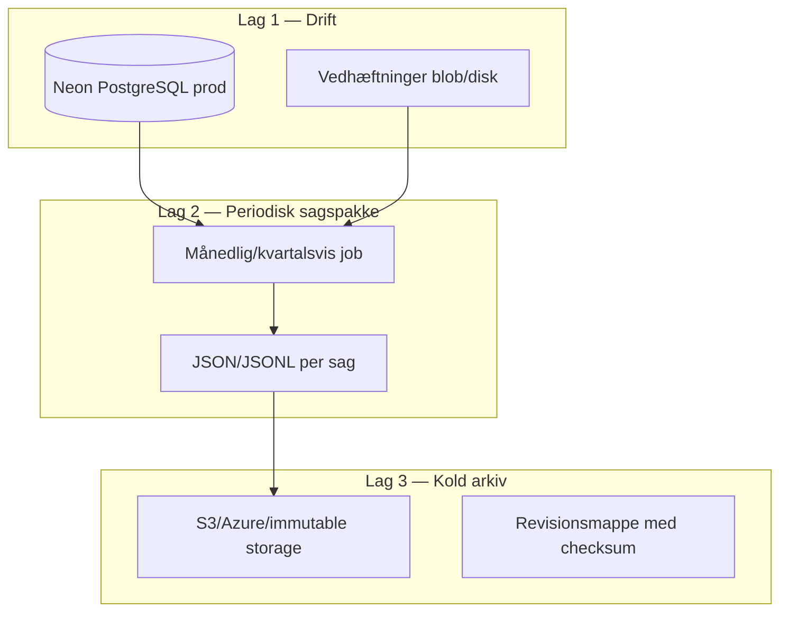

# Sagsarkiv og produktion — bevaring til revision og andre systemer

Opdateret: 2026-06-06 (tidslinje UX + produktkrav). Reference fra chat — hent frem ved behov før go-live eller arkiv-/migrationsarbejde.

**Kontekst:** Sager er STARDESK’s vigtigste aktiv. Denne note beskriver hvad der allerede gemmes, hvad der mangler, og en anbefalet tre-lags strategi til produktion.

**Relateret:** `docs/data-model.md`, `docs/classic-itsm-data-model-mapping.md`, `apps/api/src/star_itsm_api/services/ticket_export.py`, `ticket_import.py`

---

## Hvad STARDESK allerede gemmer (godt fundament)

En sag er ikke bare én række. Den består af:

| Del | Tabel | Revisionsværdi |
|-----|-------|----------------|
| Sagens kerne | `tickets` | nummer, titel, beskrivelse, status, prioritet, SLA-tidsstempler, tildeling, tags |
| Historik / audit | `ticket_events` | hvem gjorde hvad, hvornår (`ticket.status_changed`, `comment.created`, `email.received`, osv.) |
| Kommunikation | `ticket_comments` | interne og eksterne noter |
| E-mail | `ticket_emails` | fuld tråd (afsender, emne, body) |
| Vedhæftninger | `attachments` | metadata + fil på disk (`storage_key`) |
| Relationer | `ticket_stakeholders`, `ticket_links`, `ticket_sub_causes` | interessenter, links, underårsager |

Vigtige detaljer:

- **Soft delete** — sager slettes ikke fysisk; `deleted_at` skjuler dem i UI, men de ligger stadig i DB.
- **Milepælstidsstempler** — `created_at`, `assigned_at`, `first_response_at`, `resolved_at`, `closed_at` osv. giver sporbar SLA-historik.
- **Ændringslog** — `ticket_events` med JSON `payload` er revisionsspor (bedre end kun “nuværende status”).
- **Sagsforløb-tidslinje (UX)** — `StatusTimeline` viser Oprettet → Tildelt → I arbejde → Løst → Lukket med tidsstempler; data kommer fra `ticket.timestamps` (samme felter som arkiv).

Det er nok til **drift og intern revision**, men ikke automatisk nok til **langtidsarkiv** eller **flytning til ServiceNow/andet eksternt system**.

---

## Sagsforløb-tidslinje — UX-krav (obligatorisk på alle sager)

**Produktkrav:** Statusforløb (stepper med milepæle og dato/tid) skal vises i **normal sagvisning** for staff, portal og classic — ikke kun i prototype eller arkiv-eksport.

| Trin i UI | Databasefelt | Bemærkning |
|-----------|--------------|------------|
| Oprettet | `created_at` | |
| Tildelt | `assigned_at` | Sættes ved første tildeling |
| I arbejde | `in_progress_at` | Fallback: `first_response_at` |
| Løst | `resolved_at` | |
| Lukket | `closed_at` / `cancelled_at` | |

**Kanonical UI:** `apps/web/src/components/portal/ticket/status-timeline.tsx` via `TicketCaseLayout` (`ticket-case-layout.tsx`).

**Ruter der skal have tidslinjen:**

| Rute | Bruger |
|------|--------|
| `/tickets/[id]` | Staff (primær sagvisning) |
| `/portal-v2/sag/[id]` | Borger / indmelder |
| `/classic/tickets/[id]` | Classic UI |
| Kanban-drawer | Staff (via `TicketDetailView` → `TicketCaseLayout`) |

**Arkiv:** Fuld sag-eksport skal inkludere `timestamps`-blokken **og** `ticket_events` (tidslinjen alene viser ikke genåbning, prioritetsændringer osv.).

**Nuancer:**

- `on_hold` vises under “I arbejde”; detaljer i aktivitetslog.
- Ved genåbning beholdes gamle milepæle (korrekt til revision); “genåbnet” kræver `ticket_events`.

---

## Hvad der mangler i dag (vigtigt at vide)

1. **Excel-eksport er oversigt, ikke fuld sag**  
   `GET /api/v1/reports/tickets/export` giver liste med sagsnr, titel, status, tidsstempler — **ikke** kommentarer, events, vedhæftninger eller e-mails.

2. **Vedhæftninger ligger uden for databasen**  
   Filer gemmes via `storage_key` (upload-mappe). DB-backup alene er **ikke** nok; vedhæftninger skal backup’es separat.

3. **Ingen formel opbevaringspolitik i koden**  
   Der er ingen “arkivér efter 5 år” / “slet CPR efter X” — det skal besluttes som forretnings-/GDPR-politik.

4. **Import findes (CSV/JSON → STARDESK), ikke fuld eksport (STARDESK → andet)**  
   `ticket_import.py` kan tage data **ind** fra CSV/JSON. Vejen **ud** til andre systemer er ikke færdigbygget som standardformat.

---

## Anbefalet strategi til produktion (tre lag)



### Lag 1: Drift (det I har nu)

- **Neon `main`** som produktionsdatabase.
- Aktivér **Neon point-in-time recovery / backups** (Neon har PITR på betalte planer — tjek Neon-plan).
- Vedhæftninger på **durable storage** (ikke kun lokal disk på Vercel serverless — i prod bør det være blob storage).

Dette beskytter mod nedbrud, men er svært at bruge til revision “giv mig alle sager fra 2024 med fuld historik” uden at grave i DB.

### Lag 2: Periodisk “sagspakke” (bør bygges før go-live)

For hver lukket sag (eller alle sager månedligt), eksporter én **komplet JSON-pakke**:

```json
{
  "ticket": { "ticket_number": "INC-2026-00042", "status": "closed" },
  "comments": [],
  "events": [],
  "emails": [],
  "attachments": [{ "filename": "...", "sha256": "...", "storage_url": "..." }],
  "stakeholders": [],
  "timestamps": {
    "created_at": "...",
    "assigned_at": "...",
    "in_progress_at": "...",
    "resolved_at": "...",
    "closed_at": "..."
  },
  "exported_at": "2026-06-06T12:00:00Z",
  "export_version": "1.0"
}
```

**Hvorfor JSON og ikke kun Excel?**

- Maskinlæsbart til andre ITSM-systemer
- Bevarer nested historik (events, kommentarer)
- Kan versioneres (`export_version`)
- Kan signeres/checksummes til revision

Excel kan stadig bruges til **rapportering**; JSON er til **arkiv og migration**.

### Lag 3: Koldt arkiv (revision / lovkrav)

- Gem sagspakker i **immutable storage** (WORM / object lock) eller mindst versioneret bucket.
- Log hvem der eksporterede hvornår (separat audit uden for appen).
- Beslut **opbevaringsperiode** (fx 5 år for IT-drift, længere hvis offentlig sektor/BOFA).
- **GDPR**: `subject_cpr` og persondata — plan for sletning/anonymisering efter periode, mens sagens faglige indhold bevares.

---

## Konkret: hvad gøres før produktion?

| Prioritet | Handling | Formål |
|-----------|----------|--------|
| 1 | Neon backup + PITR dokumenteret | Gendannelse ved nedbrud |
| 2 | Vedhæftninger til blob (S3/Vercel Blob) | Filer overlever deploy/restart |
| 3 | **Fuld sag-eksport API** (JSON per sag + bulk) | Revision + migration |
| 4 | Planlagt job: lukkede sager → arkiv-bucket | Automatisk compliance |
| 5 | `external_id` / `source_system` på tickets ved import | Sporbarhed ekstern kilde ↔ STARDESK |
| 6 | Beslut retention-politik (slet vs. arkivér) | GDPR + revision |

---

## Brug i praksis

| Behov | Løsning |
|-------|---------|
| **Revision** (revisor: “vis sag INC-2026-00042 fra oprettelse til luk”) | Hent sagspakke fra koldt arkiv **eller** query live DB: `tickets` + `ticket_events` + `ticket_comments` + `ticket_emails` + attachment-metadata |
| **Flytning til andet system** | Brug JSON-pakken som kilde; map felter via `docs/classic-itsm-data-model-mapping.md` (omvendt retning). Import ind i STARDESK: `ticket_import.py` |
| **Daglig drift** | Neon + soft delete + `ticket_events` er nok |
| **Langsigtet bevis** | Kun med lag 2+3 (periodisk eksport + kold storage) |

---

## Kort konklusion

STARDESK **gemmer sagerne struktureret og revisionsvenligt i databasen** — især via `ticket_events`, tidsstempler og relaterede tabeller. Solidt til produktion **som driftssystem**.

Til **revision og genbrug i andre systemer** mangler primært:

1. **Fuld sag-eksport** (ikke kun Excel-liste)
2. **Backup af vedhæftninger** sammen med DB
3. **Formel arkiv- og opbevaringspolitik**

**Næste skridt (forslag):** `GET /api/v1/tickets/{id}/export` (JSON-pakke) + månedligt arkiv-job — mest værdifuld investering før go-live.

---

## Eksisterende API / kode

| Sti | Betydning |
|-----|-----------|
| `GET /api/v1/reports/tickets/export` | Excel-liste (staff) — se `docs/demo-users-and-access.md` |
| `apps/api/src/star_itsm_api/services/ticket_export.py` | Excel-bygger |
| `apps/api/src/star_itsm_api/services/ticket_import.py` | Bulk import CSV/JSON |
| `apps/api/src/star_itsm_api/services/ticket_activity.py` | Events → danske labels |
| `apps/api/src/star_itsm_api/models/ticket_event.py` | Audit-log model |
| `apps/web/src/components/portal/ticket/status-timeline.tsx` | Sagsforløb-stepper (alle sager) |
| `apps/api/src/star_itsm_api/services/ticket_timestamps.py` | Milepælstidsstempler ved statusskift |
